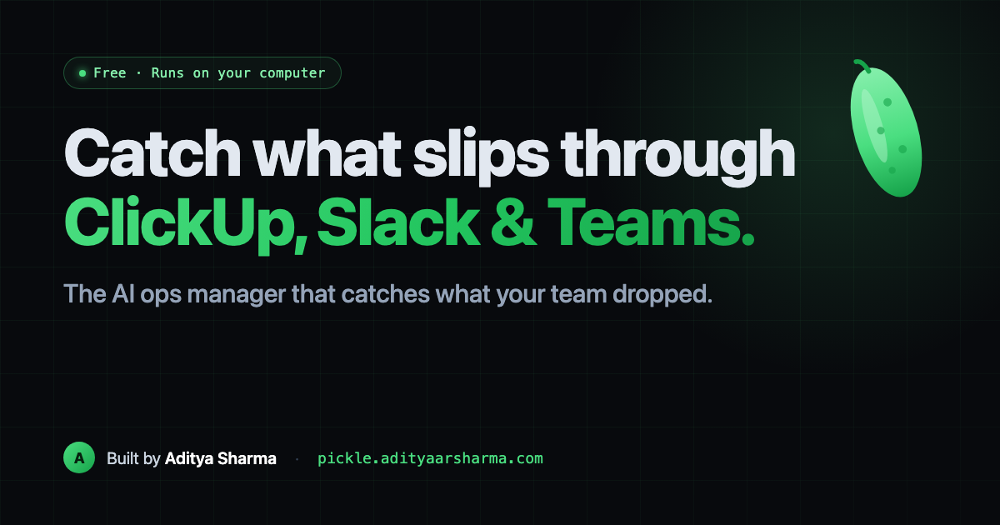

# 🥒 Pickle: the free AI ops manager for ClickUp, Slack & Teams



> **ClickUp Brain reads your tasks. Slack AI reads your messages. Both are paid add-ons, and each only sees its own app.**
> **Pickle is a free AI ops manager that runs on your own machine, reads across all three, and tells you what slipped through: stale tasks, dropped promises, decisions buried in a DM.**

[](LICENSE)
[](https://modelcontextprotocol.io)
[](#privacy)
[](#works-with)
[](https://github.com/adityaarsharma/pickle/stargazers)

Pickle is a free, open-source **AI ops manager** for your team, packaged as an MCP server you run yourself. Give it **your own** ClickUp / Slack / Teams token, and your AI client (Claude, Cursor, Codex, Cline, Zed…) audits your workspace the way a sharp ops manager would: catching the work that quietly fell through.

**No account. No hosted server. No key from us. No telemetry.** Pickle adds no middleman. It talks only to *your* tools, with *your* token. Nothing is sent to us, because there's no "us" to send it to.

> ⭐ **Pickle is free and will stay free. There is no paid tier.** If you think workspace tools should run on your own machine, **star the repo.** Stars are the only way it gets found.

---

## <a id="privacy"></a>Why this is different

| | ClickUp Brain | Slack AI | **Pickle** |
|---|---|---|---|
| Sees **across** your tools | ❌ ClickUp only | ❌ Slack only | ✅ ClickUp + Slack + Teams |
| Where your data flows | Their cloud | Their cloud | **Only to your own tools, with your token** |
| A third party holds your token | Yes | Yes | **No, it stays in your local config** |
| Cost | Paid add-on | ~$10/user/mo | **Free · MIT · open source** |
| You can read every line | ❌ | ❌ | ✅ it's all right here |

Honest version of the privacy claim: Pickle *does* read your ClickUp/Slack/Teams. That's the job. But it reads them **directly, from your machine, with your token**, and sends nothing to any Pickle server. Verify it yourself. The code is in [`server-remote/server.mjs`](server-remote/server.mjs), and there is no analytics, no beacon, no phone-home.

---

## <a id="install"></a>Install: one command

Guided: it asks which tools you use, points you to where each token lives, and writes your MCP config for you.

```bash
curl -fsSL https://pickle.adityaarsharma.com/install.sh | bash
```

**Or add it to your MCP client yourself** (via [npm](https://www.npmjs.com/package/pickle-mcp)):

```json
{
  "mcpServers": {
    "pickle": {
      "command": "npx",
      "args": ["-y", "pickle-mcp"],
      "env": { "CLICKUP_API_KEY": "pk_your_own_token" }
    }
  }
}
```

Add `SLACK_TOKEN` (`xoxp-…`) and/or `TEAMS_TOKEN` to the same `env` block to switch on the cross-tool patterns. Restart your client. `npx` runs it locally on your machine, no global install, no clone.

The installer asks which tools you use (ClickUp / Slack / Teams), takes the token *you already have* for each, and writes the MCP config for your client automatically. No hand-editing, no key from us.

> Prefer to do it by hand? See [`docs/manual-install.md`](docs/manual-install.md). The only token you ever provide is your own platform token (e.g. ClickUp `pk_…` from Settings → Apps).

Then just ask your AI:

> *"Pickle, run my morning audit: scan my ClickUp from the last 7 days and show me the 3 worst things I missed, worst first."*

---

## What it catches

- **Stale in-progress**: "doing" for days, zero activity
- **Dropped promises**: "I'll do X by Friday" with no follow-through
- **Decisions buried in DMs**: a call made in a thread that never became a task
- **Delegations nobody chased**: you asked, it never landed, everyone forgot
- **Standup copy-paste**, zombie tasks, empty-description work, blocker rot… full list in [`docs/patterns.md`](docs/patterns.md)

---

## <a id="works-with"></a>Works with

Claude Code · Claude Desktop · Cursor · Codex · Cline · Continue · Zed · any MCP host. The reasoning runs in **your** model. Pickle just fetches and structures the data. Optional [Claude Code skills](docs/skills.md) add `/pickle-*` slash commands as a convenience layer.

---

## Free, and what I ask instead of money

Pickle has no paid tier and never will. Instead:

- ⭐ **Star the repo** if it saves you a dropped ball.
- 📮 **[Get update notes + workspace-AI tips](https://adityaarsharma.com)**: occasional, practical notes on using AI in real team workflows (the same patterns Pickle runs). Reply anytime with a suggestion or a pattern you want added. I read every one.

### 🧭 Want your team to actually *use* AI well?

Pickle is what I use to keep my own team honest. If you're rolling AI into how your company works (onboarding people onto it, wiring it into real workflows, choosing which LLM for what), **[reach out to me](https://adityaarsharma.com/?src=pickle-readme)**. I help teams go from "we bought AI licenses" to "AI is actually in our workflow," with real use-cases instead of hype.

Built in the open by **[Aditya Sharma](https://adityaarsharma.com)**, a marketer who codes.

## FAQ

**Is Pickle really free?**
Yes. MIT-licensed, no paid tier, no account, no credit card. I built it in the open; a ⭐ is the only thing I ask.

**Do I need a Pickle account or an API key from you?**
No. Pickle issues nothing. The only token you provide is your *own* ClickUp / Slack / Teams token, and it lives in your local MCP config.

**Does my data get sent to you or to any cloud?**
No middleman. Pickle runs on your machine and talks only to *your* tools (ClickUp / Slack / Microsoft Graph) using *your* token. There is no Pickle server, no telemetry, no phone-home. Pickle does read your ClickUp/Slack/Teams (that's the job), but it sends nothing to us. Verify it in [`server-remote/server.mjs`](server-remote/server.mjs).

**Which AI clients does it work with?**
Any MCP-compatible host: Claude Code, Claude Desktop, Cursor, Codex, Cline, Continue, Zed, and more. The reasoning runs in *your* model.

**How is this different from ClickUp Brain or Slack AI?**
Those are cloud add-ons that each see only their own tool and send your data to their servers. Pickle runs locally, reads *across* ClickUp + Slack + Teams, and keeps your token on your machine. Different axis: privacy + cross-tool, not "more features."

**Is it safe to give it my token?**
The token stays in your local config file (`chmod 600`), and the code is open. Read it before you connect. Nothing is transmitted anywhere except the platform's own API.

**Do I need Slack and Teams too, or is ClickUp enough?**
ClickUp alone is a great start. Slack/Teams unlock the cross-tool patterns (decisions-in-DMs, ghost mode) because those need chat data.

**Can it audit GitHub or other tools?**
Not yet. A GitHub audit (stale PRs, dropped reviews) is a planned/welcome contribution.

**Is there a hosted version?**
No. Pickle is local by design. If you want your team to adopt AI tools like this well, [reach out](https://adityaarsharma.com). That's the consulting I do.

## Contributing

Issues and PRs welcome: new patterns, new connectors (a GitHub audit for stale PRs is a great first one), better client configs.

## License

MIT © [Aditya Sharma](https://adityaarsharma.com)
